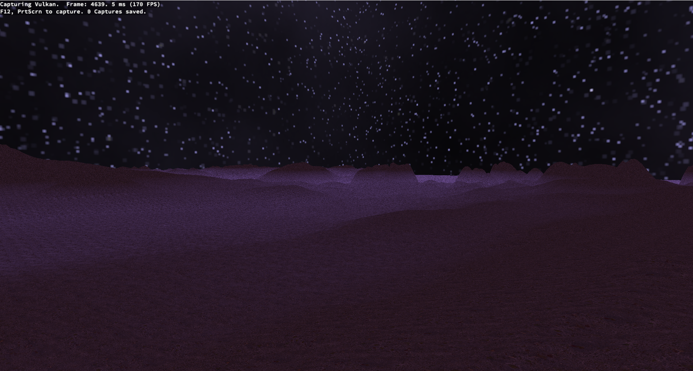

# Vulkan uhh stuff



Just me messing about with Vulkan. Currently it's got a decent camera controller, model loading/texturing, cubemap 
functionality and heightmap terrain gen with some texture blending. Pretty unoptomized at the minute, especially 
the parts relating to descriptor sets. If you plan on tweaking the shaders at all, you'll have to recompile them with glslc, which is 
included in the Vulkan SDK. The easiest way to quickly recompile those would be to write a .bat file in 
the shader directory that would look something like the following:

```bat
[path to vulkansdk/.../glslc.exe] shader.vert -o vert.spv
[path to vulkansdk/.../glslc.exe] shader.frag -o frag.spv
```

### Setup
The cmake building setup assumes the existence of a subdirectory titled 'libs', which stores the directories for the vulkan SDK, as well as
glm and glfw. It also stores the header files for stb_image and tiny_obj_loader. You might be better of using something like vcpkg for
some of these, but I always have issues with it

### Some TroubleShooting
If this doesn't build, it's almost definitely some issue with the CMakeLists file, so I'd look there first. The file loading is also
assuming that the out directory is three levels deep from the root directory, so the pipeline, model, image and cubemap implementation
files have a ``../../../`` definition at the top of their files, which you should change as needed. You can also check
https://vulkan.gpuinfo.org/listdevices.php to see if the cause of trouble is an unsupported feature or lower than
required device limits.

### Dependency resources:
Vulkan SDK: https://vulkan.lunarg.com/

GLM: https://github.com/g-truc/glm

GLFW: https://www.glfw.org/download.html

STB_IMAGE: https://github.com/nothings/stb

TINY_OBJ_LOADER: https://github.com/tinyobjloader/tinyobjloader

### Anything else I used:
Skybox creation software: https://github.com/petrocket/spacescape

Room model: https://sketchfab.com/3d-models/viking-room-a49f1b8e4f5c4ecf9e1fe7d81915ad38

Terrain Textures: https://polyhaven.com/a/coast_sand_05,
https://polyhaven.com/a/snow_field_aerial

Website used for some of the heightmap generation: https://manticorp.github.io/unrealheightmap/